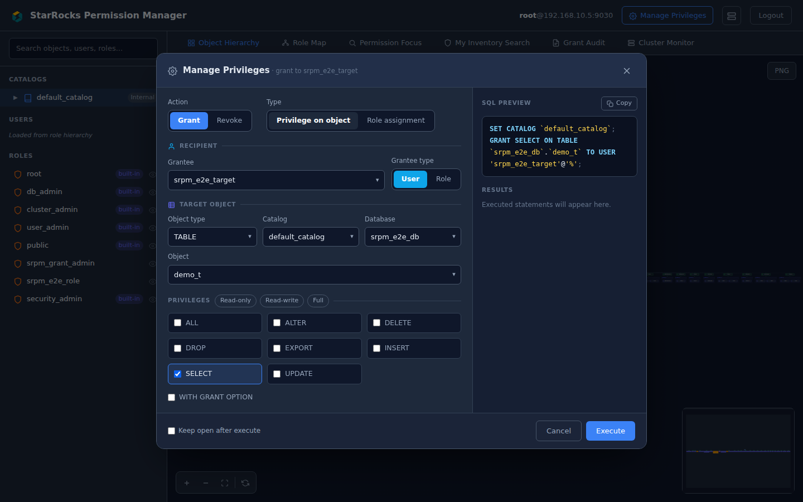
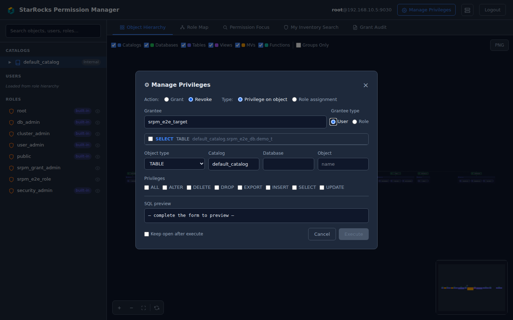
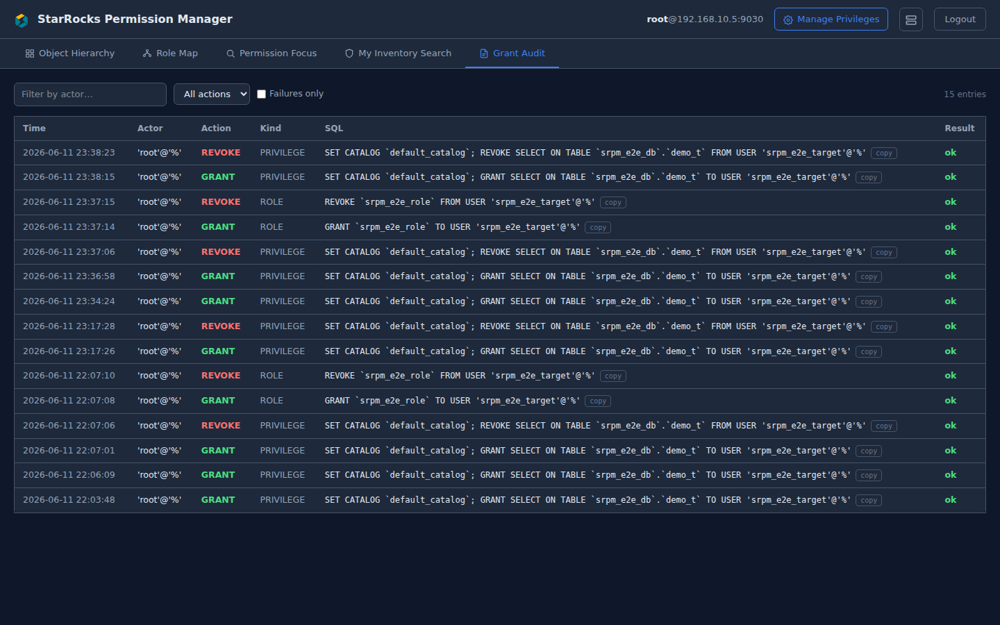
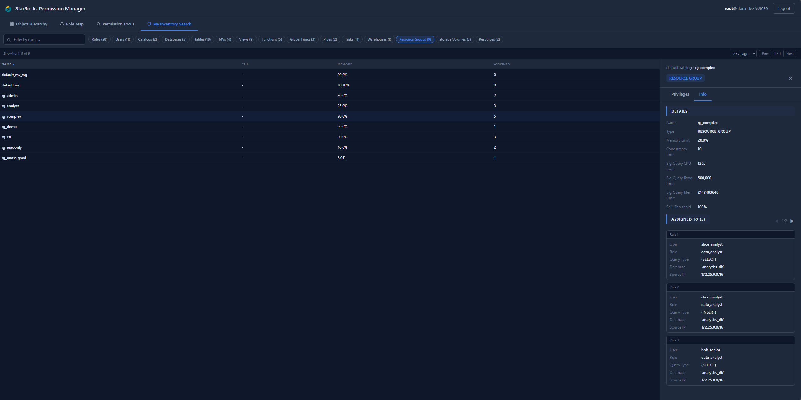
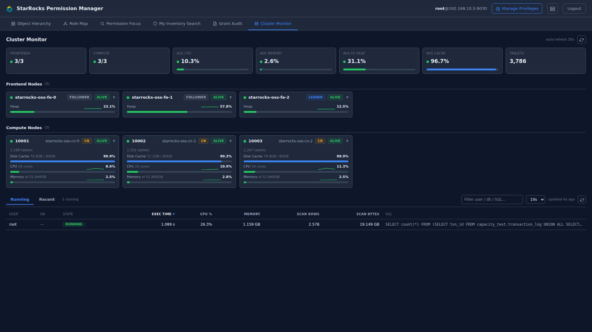

# StarRocks Permission Manager

[](https://codecov.io/gh/EdwardArchive/starrocks-permission-manager)

A web UI for visually exploring user, role, and object permission structures across StarRocks clusters using DAG (Directed Acyclic Graph) visualization.


## Features

- **6 Tabs** for different exploration modes
  - **Object Hierarchy**: SYSTEM → CATALOG → DATABASE → Tables / Views / MVs / Functions (top-to-bottom DAG)
  - **Role Map**: root → built-in roles → custom roles → users (top-to-bottom DAG with full inheritance chain)
  - **Permission Focus**: Search a user or role → view inheritance DAG + privilege list (admin only)
  - **My Inventory**: Browse all accessible objects by type with detail side panel (Roles, Users, Catalogs, Databases, Tables, MVs, Views, Functions, Resource Groups, Warehouses, etc.)
  - **Cluster Monitor**: FE/BE/CN node dashboard + running-queries panel (auto-refresh)
- **Admin & Non-Admin Support** — Admin users see all roles/users/objects via `/api/admin/*` routes (sys.* tables). Non-admin users see only their accessible objects and role chain via `/api/user/*` routes (SHOW GRANTS + INFORMATION_SCHEMA). Admin routes enforce `require_admin` (403 for non-admin).
- **Cluster Monitor** — Full-page dashboard (tab) with a KPI gauge band, node health cards (CPU/heap trend sparklines, dead nodes first), and a **Running / Recent queries** panel. Running: sortable by exec time / CPU% / memory / scan volume, an instantaneous CPU share, text filter, selectable refresh interval, click a row for the full SQL, and a **KILL** action for grant admins (audited to `grant_log`). Recent: completed-query history from the StarRocks AuditLoader plugin with an errors-only filter. The header cluster icon shows a red badge when any node is down and opens a live gauge drawer (15 s auto-refresh) whose KPIs, alerts, and top-query preview jump straight to the matching section in the tab. Node inventory and queries require `cluster_admin` (SYSTEM OPERATE); non-privileged users get a limited view.
- **Object Permission Matrix** — Click an object to see a grantee × privilege matrix (Direct/Inherited indicators), with type-specific columns per object type
- **Implicit USAGE** — TABLE-level grants automatically show implicit DATABASE/CATALOG USAGE access
- **User/Role Privilege View** — Unified scope-grouped tree (GrantTreeView) across all panels
- **Details Tab** — Type-specific metadata per object (columns, DDL, distribution, partitions — INFORMATION_SCHEMA based, External Catalog compatible)
- **My Inventory Browser** — Sub-tab based object list with pagination, sorting (A→Z/Z→A), filtering, and 420px detail side panel
- **Sidebar Navigation** — Searchable hierarchy browser with hide/show toggles per node
- **Filters** — Toggle node types via checkboxes, Groups Only mode
- **Export** — Download DAG as high-resolution PNG


### Manage Privileges (v2.0)

Administrators holding the `user_admin` capability can GRANT/REVOKE privileges and role
assignments directly from the UI (`⚙ Manage Privileges` in the header), with a live SQL
preview and a confirmation step. Every attempt — including denied ones — is recorded in
the `srpm_audit.grant_log` table and browsable in the **Grant Audit** tab.

One-time operator setup (audit table + `srpm_grant_admin` bundle role):

```bash
mysql -h <fe-host> -P 9030 -uroot -p < docs/sql/setup_grant_admin.sql
# then, per administrator:
#   GRANT srpm_grant_admin TO USER 'alice'@'%';
```



Design and validation notes: `docs/GRANT_REVOKE_DESIGN.md`.

### Kubernetes Deployment

`k8s/srpm.yaml` deploys the app (image: `docker.io/kjjs1996/starrocks-permission-manager`)
behind the existing Cloudflare Tunnel. One-time: create the `srpm-jwt` secret, then add the
tunnel public hostname → `srpm.<ns>.svc.cluster.local:8001`. Keep `replicas: 1`
(in-memory sessions). Recommended: gate the public hostname with a Cloudflare Access policy.

## Quick Start

### Docker (Recommended)

```bash
docker build -t starrocks-permission-manager .
docker run -d -p 8001:8001 \
  -e SRPM_JWT_SECRET=your-secret-key \
  starrocks-permission-manager
```

Open http://localhost:8001 and log in with your StarRocks credentials.

> **Note:** The Docker image runs a single worker (`--workers 1`) because the in-memory session store is per-process. For multi-worker deployments, use a shared session backend (e.g., Redis) or sticky sessions.

### Development

**Prerequisites:** Python 3.10+, Node.js 18+, npm 9+

**Backend (Terminal 1):**
```bash
cd backend
python -m venv venv
source venv/bin/activate        # Windows: venv\Scripts\activate
pip install -r requirements.txt
uvicorn app.main:app --reload --port 8888
```
- API server: http://localhost:8888
- Swagger UI: http://localhost:8888/docs

**Frontend (Terminal 2):**
```bash
cd frontend
npm install
npm run dev
```
- App: http://localhost:5173
- API requests are proxied to the backend (`/api/*` → `localhost:8888`)

### Production Build

```bash
# Build frontend
cd frontend && npm run build    # → dist/

# Run backend serving static files
cd backend
uvicorn app.main:app --host 0.0.0.0 --port 8001
```

Or use **Nginx** to serve the frontend and proxy API requests:
```nginx
server {
    listen 80;
    root /path/to/frontend/dist;
    index index.html;

    location /api/ {
        proxy_pass http://localhost:8001;
        proxy_set_header Host $host;
        proxy_set_header X-Real-IP $remote_addr;
    }

    location / {
        try_files $uri $uri/ /index.html;
    }
}
```

## UI Guide

### Manage Privileges (GRANT/REVOKE)
Wizard for granting/revoking object privileges and role assignments with a live SQL preview.
In Revoke mode, the grantee's existing direct grants are listed so only real grants can be revoked.



### Grant Audit
Every GRANT/REVOKE attempt (including denied ones) recorded in `srpm_audit.grant_log`.



### Object Hierarchy


### Role Map


### Permission Focus


### My Inventory


### Resource Groups


### Cluster Monitor
KPI gauge band + node cards (CPU/heap sparklines) + Running/Recent queries with
instant CPU share and grant-admin KILL (issue #15).



### Object Detail — Permission Matrix


### User Detail — Effective Privileges


### Tabs

| Tab | Description | Admin Only |
|-----|-------------|-----------|
| **Object Hierarchy** | Visualizes SYSTEM → Catalog → DB → Objects as a top-down DAG. Group containers bundle tables/views/MVs/functions per database. | No |
| **Role Map** | Shows role inheritance with full BFS child traversal. Clicking a role shows the complete inheritance chain (parents + children + users). | No |
| **Permission Focus** | Search for a user or role to view their inheritance DAG and full privilege list side-by-side. | Yes |
| **My Inventory** | Browse all accessible objects organized by sub-tabs (Roles, Users, Catalogs, Databases, Tables, MVs, Views, Functions, Resource Groups, Warehouses, etc.) with a detail side panel. | No |
| **Cluster Monitor** | KPI gauges + FE/BE/CN node cards (sparklines) + Running/Recent queries (filter, instant CPU%, grant-admin KILL, completed-query history). Node/query data requires `cluster_admin`; others see a limited view. | No |

### My Inventory Sub-tabs

| Sub-tab | What it shows |
|---------|--------------|
| **Roles** | Admin: all roles (builtin/custom). Non-admin: direct + inherited roles. Click → privilege tree + members. |
| **Users** | Admin: all users with User/Host columns. Non-admin: empty. Click → effective privileges + assigned roles. |
| **Catalogs** | Accessible catalogs with type (Internal/Jdbc). Click → privilege matrix + databases list. |
| **Databases** | Accessible databases. Click → privilege matrix + objects list. |
| **Tables** | All accessible tables with Database, Rows, Size columns. Click → privilege matrix + column/DDL detail. |
| **MVs** | Materialized views with Rows, Size. Click → privilege matrix + column/DDL detail. |
| **Views** | Views. Click → privilege matrix + column detail. |
| **Functions** | User-defined functions. Click → privilege matrix. |
| **Resource Groups** | Resource groups with CPU, Memory, Assigned columns. Admin: all groups. Non-admin: user-scoped groups. Click → resource limits detail + assignment rules (paginated, current user highlighted). System default groups show fallback notice. |

Features: text filter, A→Z/Z→A column sorting, pagination (10/25/50/100 per page).

### Admin vs Non-Admin

| Feature | Admin (sys.* accessible) | Non-Admin (SHOW GRANTS only) |
|---------|-------------------------|------------------------------|
| Object Hierarchy | All objects in cluster | Only accessible objects (SET ROLE ALL) |
| Role Map | All roles + all users | Own role chain only (includes implicit `public`) |
| Permission Focus | Available | Hidden |
| My Inventory | All roles, all users | Own roles/objects only |
| Permission Matrix | All grantees shown | Own role chain grantees |
| Implicit USAGE | Shown on DB/Catalog | Shown on DB/Catalog |
| Cluster Monitor (tab + drawer) | Full FE/BE/CN inventory + running queries | Single FE (the one you're connected to) — `mode="limited"`; running queries show a permission notice |

#### Admin Detection — what "admin" means in this app

At login the backend runs `SET ROLE ALL` and then checks that your StarRocks account can execute **every** query the admin routes rely on:

1. `SELECT 1 FROM sys.role_edges LIMIT 1`
2. `SELECT 1 FROM sys.grants_to_users LIMIT 1`
3. `SELECT 1 FROM sys.grants_to_roles LIMIT 1`
4. `SHOW ROLES`

If **any** of these fails, you are treated as a non-admin. The simplest way to satisfy all four is to grant either of the built-in roles **`user_admin`** or **`security_admin`** — both give `SELECT` on all three `sys.*` tables *and* the ability to run `SHOW ROLES`.

```sql
-- Typical admin setup
GRANT user_admin TO <username>;
-- or for read-only admins:
GRANT security_admin TO <username>;
```

> **Note**: `cluster_admin` alone is **not** enough — it governs `SHOW FRONTENDS` / `SHOW BACKENDS` (used by the cluster drawer) but does not grant the privileges required by the Permission Focus tab or admin-scoped DAG views. If a user has only `cluster_admin`, they see the common UI plus the full cluster drawer, but not the admin tabs.

If you have admin-level roles but they aren't your default role, the app runs `SET ROLE ALL` for you — no need to `SET DEFAULT ROLE ALL` manually.

### Detail Panels

- **Object Panel (Table/View/MV/Function)**: Two sub-tabs — *Privileges* (permission matrix) and *Details* (columns, DDL, metadata).
- **Database Panel**: *Privileges* (permission matrix with USAGE, CREATE TABLE, etc.) and *Objects* (child tables/views/MVs).
- **Catalog Panel**: *Privileges* (USAGE, CREATE DATABASE, ALTER, DROP) and *Objects* (databases list).
- **Role Panel**: *Privileges* (GrantTreeView with scope grouping) and *Members* (child roles + assigned users).
- **User Panel**: *Privileges* (effective privileges GrantTreeView) and *Roles* (assigned roles list).

### Permission Matrix

Shows grantees (users/roles) × privilege types with indicators:
- **D** (green) — Direct grant
- **I** (blue) — Inherited via role hierarchy
- **-** — No access

Privilege columns are type-specific:
| Object Type | Columns |
|------------|---------|
| TABLE | SELECT, INSERT, UPDATE, DELETE, ALTER, DROP, EXPORT |
| VIEW | SELECT, ALTER, DROP |
| MV | SELECT, ALTER, DROP, REFRESH |
| FUNCTION | USAGE, DROP |
| DATABASE | USAGE, CREATE TABLE, CREATE VIEW, CREATE FUNCTION, CREATE MV, ALTER, DROP |
| CATALOG | USAGE, CREATE DATABASE, ALTER, DROP |
| SYSTEM | GRANT, NODE, OPERATE, REPOSITORY, ... |

## Documentation

| Document | Description |
|----------|-------------|
| [API Reference](docs/API.md) | Endpoint details, request/response schemas, curl examples |
| [Testing Guide](docs/TESTING.md) | Unit tests, integration tests, linting, environment variables |
| [Contributing Guide](docs/CONTRIBUTING.md) | Architecture, development setup, code quality, PR guidelines |

## Tech Stack

| Layer | Technology |
|-------|-----------|
| Backend | Python 3.10+, FastAPI, mysql-connector-python, PyJWT, pydantic-settings |
| Frontend | React 19, Vite, TypeScript, React Flow (@xyflow/react), dagre, Tailwind CSS, Zustand |
| Linting | Ruff, Bandit (backend), ESLint (frontend) |
| Deployment | Docker (multi-stage build) |

## Icon Customization

Replace SVG files in `frontend/icons/` to change icons across the entire app (DAG nodes, sidebar, header, login). All icons must be stroke-based 24x24 SVGs with explicit `width` and `height` attributes. See [frontend/icons/README.md](frontend/icons/README.md) for details.

## External Catalog Support

Uses `information_schema.tables` and `columns` as the primary data source, making it compatible with Hive, Iceberg, JDBC, Elasticsearch, and other External Catalogs. Internal Catalog-specific metadata (partitions, buckets, storage, etc.) is supplemented via `partitions_meta` + DDL parsing. Unsupported sections are automatically hidden.

## Contributing

See [docs/CONTRIBUTING.md](docs/CONTRIBUTING.md) for development setup, code quality requirements, PR guidelines, and project conventions.

## License

MIT
