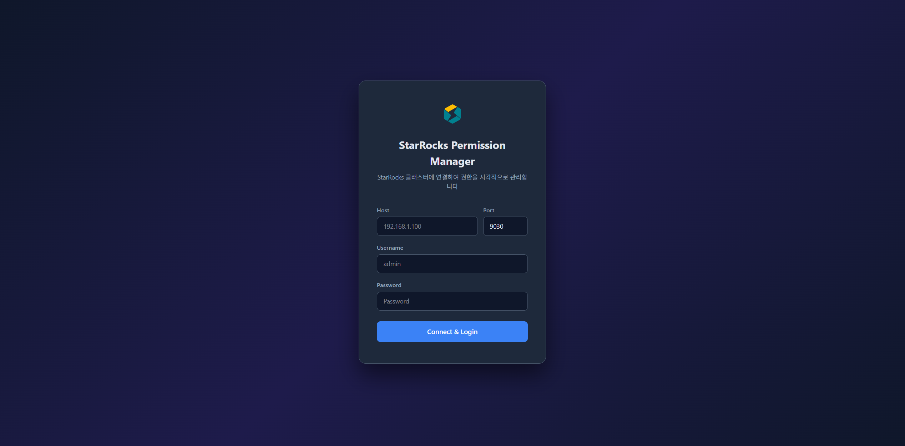
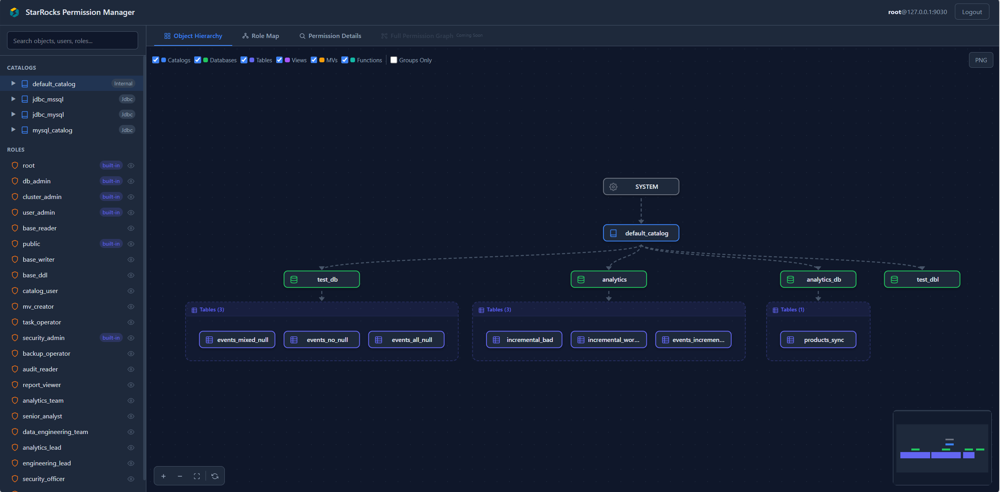
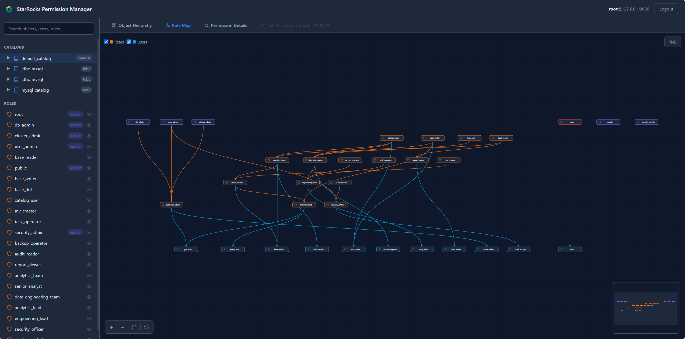
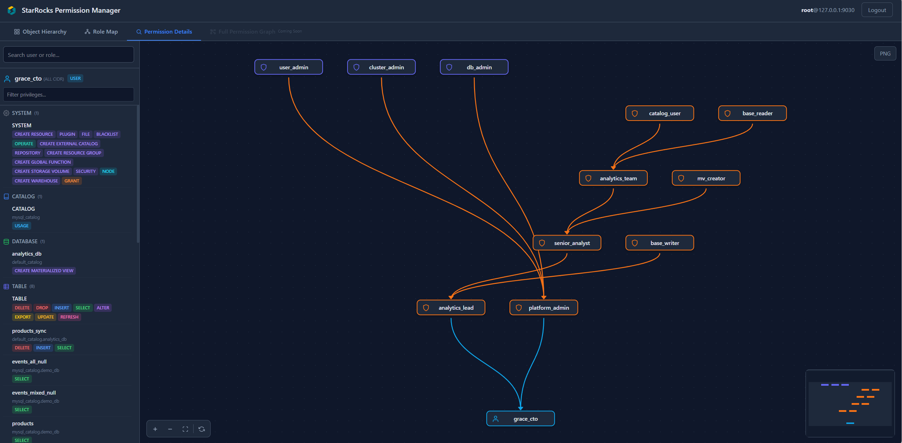
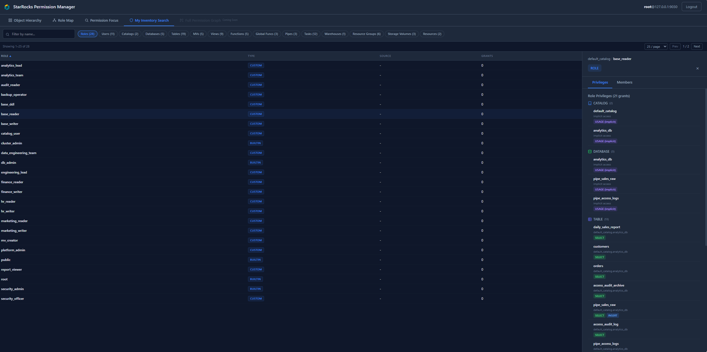
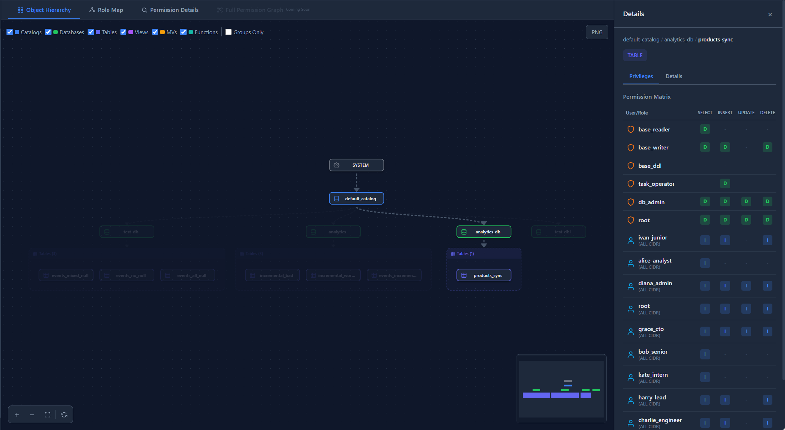
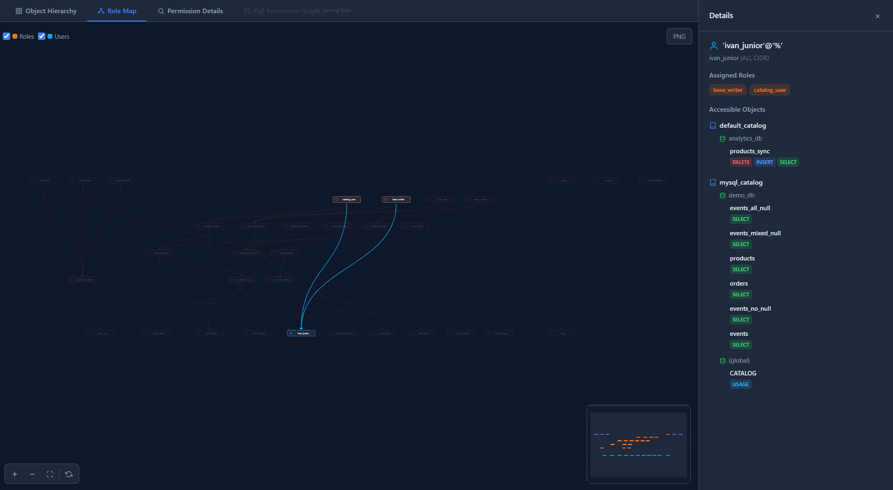

# StarRocks Permission Manager

A web UI for visually exploring user, role, and object permission structures across StarRocks clusters using DAG (Directed Acyclic Graph) visualization.



## Features

- **5 Tabs** for different exploration modes
  - **Object Hierarchy**: SYSTEM → CATALOG → DATABASE → Tables / Views / MVs / Functions (top-to-bottom DAG)
  - **Role Map**: root → built-in roles → custom roles → users (top-to-bottom DAG with full inheritance chain)
  - **Permission Focus**: Search a user or role → view inheritance DAG + privilege list (admin only)
  - **My Inventory**: Browse all accessible objects by type with detail side panel (Roles, Users, Catalogs, Databases, Tables, MVs, Views, Functions)
  - **Full Permission Graph**: Users → Roles → Objects unified view (coming soon)
- **Admin & Non-Admin Support** — Admin users see all roles/users/objects. Non-admin users see only their accessible objects and role chain, using `SHOW GRANTS` fallback when `sys.*` tables are unavailable.
- **Object Permission Matrix** — Click an object to see a grantee × privilege matrix (Direct/Inherited indicators), with type-specific columns per object type
- **Implicit USAGE** — TABLE-level grants automatically show implicit DATABASE/CATALOG USAGE access
- **User/Role Privilege View** — Unified scope-grouped tree (GrantTreeView) across all panels
- **Details Tab** — Type-specific metadata per object (columns, DDL, distribution, partitions — INFORMATION_SCHEMA based, External Catalog compatible)
- **My Inventory Browser** — Sub-tab based object list with pagination, sorting (A→Z/Z→A), filtering, and 420px detail side panel
- **Sidebar Navigation** — Searchable hierarchy browser with hide/show toggles per node
- **Filters** — Toggle node types via checkboxes, Groups Only mode
- **Export** — Download DAG as high-resolution PNG
- **Customization** — Replace SVG icons and app logo

## Screenshots

### Object Hierarchy


### Role Map


### Permission Focus


### My Inventory


### Object Detail — Permission Matrix


### User Detail — Effective Privileges


## Architecture

```
├── Dockerfile           # Multi-stage build (frontend + backend)
├── backend/             # Python FastAPI server
│   ├── requirements.txt
│   ├── API.md           # Detailed API documentation
│   └── app/
│       ├── main.py
│       ├── config.py
│       ├── dependencies.py     # JWT auth + DB connection DI
│       ├── routers/            # auth, objects, privileges, roles, dag, search
│       ├── services/           # starrocks_client, user_service
│       ├── models/             # Pydantic schemas
│       └── utils/              # JWT session, session store, cache, role_helpers, sys_access
└── frontend/            # React 18 + Vite + TypeScript
    ├── icons/           # Customizable SVG icons (single source of truth)
    └── src/
        ├── api/         # API clients
        ├── stores/      # Zustand state management
        ├── utils/       # grantDisplay, privColors, scopeConfig, toast
        └── components/
            ├── auth/    # Login form
            ├── layout/  # Header, Sidebar
            ├── common/  # InlineIcon, GrantTreeView, ExportPngBtn
            ├── dag/     # React Flow + dagre layout
            ├── tabs/    # PermissionDetailTab (Permission Focus), InventoryTab (My Inventory)
            └── panels/  # Object / User / Group detail panels
```

## Quick Start

### Docker (Recommended)

```bash
docker build -t starrocks-permission-manager .
docker run -d -p 8001:8001 \
  -e SRPM_JWT_SECRET=your-secret-key \
  starrocks-permission-manager
```

Open http://localhost:8001 and log in with your StarRocks credentials.

> **Note:** The Docker image runs a single worker (`--workers 1`) because the in-memory session store is per-process. For multi-worker deployments, use a shared session backend (e.g., Redis) or sticky sessions.

### Development

**Prerequisites:** Python 3.10+, Node.js 18+, npm 9+

**Backend (Terminal 1):**
```bash
cd backend
python -m venv venv
source venv/bin/activate        # Windows: venv\Scripts\activate
pip install -r requirements.txt
uvicorn app.main:app --reload --port 8001
```
- API server: http://localhost:8001
- Swagger UI: http://localhost:8001/docs

**Frontend (Terminal 2):**
```bash
cd frontend
npm install
npm run dev
```
- App: http://localhost:5173
- API requests are proxied to the backend (`/api/*` → `localhost:8001`)

### Production Build

```bash
# Build frontend
cd frontend && npm run build    # → dist/

# Run backend serving static files
cd backend
uvicorn app.main:app --host 0.0.0.0 --port 8001
```

Or use **Nginx** to serve the frontend and proxy API requests:
```nginx
server {
    listen 80;
    root /path/to/frontend/dist;
    index index.html;

    location /api/ {
        proxy_pass http://localhost:8001;
        proxy_set_header Host $host;
        proxy_set_header X-Real-IP $remote_addr;
    }

    location / {
        try_files $uri $uri/ /index.html;
    }
}
```

## UI Guide

### Tabs

| Tab | Description | Admin Only |
|-----|-------------|-----------|
| **Object Hierarchy** | Visualizes SYSTEM → Catalog → DB → Objects as a top-down DAG. Group containers bundle tables/views/MVs/functions per database. | No |
| **Role Map** | Shows role inheritance with full BFS child traversal. Clicking a role shows the complete inheritance chain (parents + children + users). | No |
| **Permission Focus** | Search for a user or role to view their inheritance DAG and full privilege list side-by-side. | Yes |
| **My Inventory** | Browse all accessible objects organized by sub-tabs (Roles, Users, Catalogs, Databases, Tables, MVs, Views, Functions) with a detail side panel. | No |
| **Full Permission Graph** | Combined users → roles → objects graph with privilege-colored edges. | Coming soon |

### My Inventory Sub-tabs

| Sub-tab | What it shows |
|---------|--------------|
| **Roles** | Admin: all roles (builtin/custom). Non-admin: direct + inherited roles. Click → privilege tree + members. |
| **Users** | Admin: all users with User/Host columns. Non-admin: empty. Click → effective privileges + assigned roles. |
| **Catalogs** | Accessible catalogs with type (Internal/Jdbc). Click → privilege matrix + databases list. |
| **Databases** | Accessible databases. Click → privilege matrix + objects list. |
| **Tables** | All accessible tables with Database, Rows, Size columns. Click → privilege matrix + column/DDL detail. |
| **MVs** | Materialized views with Rows, Size. Click → privilege matrix + column/DDL detail. |
| **Views** | Views. Click → privilege matrix + column detail. |
| **Functions** | User-defined functions. Click → privilege matrix. |

Features: text filter, A→Z/Z→A column sorting, pagination (10/25/50/100 per page).

### Admin vs Non-Admin

| Feature | Admin (sys.* accessible) | Non-Admin (SHOW GRANTS only) |
|---------|-------------------------|------------------------------|
| Object Hierarchy | All objects in cluster | Only accessible objects (SET ROLE ALL) |
| Role Map | All roles + all users | Own role chain only |
| Permission Focus | Available | Hidden |
| My Inventory | All roles, all users | Own roles/objects only |
| Permission Matrix | All grantees shown | Own role chain grantees |
| Implicit USAGE | Shown on DB/Catalog | Shown on DB/Catalog |

### Detail Panels

- **Object Panel (Table/View/MV/Function)**: Two sub-tabs — *Privileges* (permission matrix) and *Details* (columns, DDL, metadata).
- **Database Panel**: *Privileges* (permission matrix with USAGE, CREATE TABLE, etc.) and *Objects* (child tables/views/MVs).
- **Catalog Panel**: *Privileges* (USAGE, CREATE DATABASE, ALTER, DROP) and *Objects* (databases list).
- **Role Panel**: *Privileges* (GrantTreeView with scope grouping) and *Members* (child roles + assigned users).
- **User Panel**: *Privileges* (effective privileges GrantTreeView) and *Roles* (assigned roles list).

### Permission Matrix

Shows grantees (users/roles) × privilege types with indicators:
- **D** (green) — Direct grant
- **I** (blue) — Inherited via role hierarchy
- **-** — No access

Privilege columns are type-specific:
| Object Type | Columns |
|------------|---------|
| TABLE | SELECT, INSERT, UPDATE, DELETE, ALTER, DROP, EXPORT |
| VIEW | SELECT, ALTER, DROP |
| MV | SELECT, ALTER, DROP, REFRESH |
| FUNCTION | USAGE, DROP |
| DATABASE | USAGE, CREATE TABLE, CREATE VIEW, CREATE FUNCTION, CREATE MV, ALTER, DROP |
| CATALOG | USAGE, CREATE DATABASE, ALTER, DROP |
| SYSTEM | GRANT, NODE, OPERATE, REPOSITORY, ... |

## API Usage

```bash
# Login
curl -X POST http://localhost:8001/api/auth/login \
  -H "Content-Type: application/json" \
  -d '{"host":"your-starrocks-host","port":9030,"username":"admin","password":"pwd"}'

# Extract token from response
TOKEN="eyJhbG..."

# My Inventory data (all accessible objects for current user)
curl http://localhost:8001/api/privileges/my-permissions \
  -H "Authorization: Bearer $TOKEN"

# Object privileges (permission matrix)
curl "http://localhost:8001/api/privileges/object?catalog=default_catalog&database=mydb&name=mytable&object_type=TABLE" \
  -H "Authorization: Bearer $TOKEN"

# Object Hierarchy DAG
curl "http://localhost:8001/api/dag/object-hierarchy?catalog=default_catalog" \
  -H "Authorization: Bearer $TOKEN"
```

Full API documentation: [backend/API.md](backend/API.md)

## Testing

```bash
cd backend
source venv/bin/activate
```

**Unit tests** (mock DB, no StarRocks connection required):
```bash
python -m pytest tests/ -v --ignore=tests/test_integration.py
```

**Integration tests** (requires a running StarRocks instance):
```bash
export SR_TEST_HOST=your-starrocks-host
export SR_TEST_PORT=9030
export SR_TEST_USER=admin
export SR_TEST_PASS=your-password
python -m pytest tests/test_integration.py -v -s
```

**Linting:**
```bash
# Backend
ruff check backend/app/
ruff format backend/app/ --check

# Frontend
cd frontend
npx tsc --noEmit
npx eslint src/ --max-warnings 0
```

## Environment Variables

**Backend:**
| Variable | Default | Description |
|----------|---------|-------------|
| `SRPM_JWT_SECRET` | `change-me-...` | JWT signing key (**must change in production**) |
| `SRPM_JWT_EXPIRE_MINUTES` | `60` | Token expiration time (minutes) |
| `SRPM_CACHE_TTL_SECONDS` | `60` | Server-side cache TTL |

**Integration tests:**
| Variable | Description |
|----------|-------------|
| `SR_TEST_HOST` | StarRocks FE host |
| `SR_TEST_PORT` | MySQL protocol port (default 9030) |
| `SR_TEST_USER` | Test username |
| `SR_TEST_PASS` | Test password |

## Tech Stack

| Layer | Technology |
|-------|-----------|
| Backend | Python 3.10+, FastAPI, mysql-connector-python, PyJWT, pydantic-settings |
| Frontend | React 18, Vite, TypeScript, React Flow (@xyflow/react), dagre, Tailwind CSS, Zustand |
| Linting | Ruff, Bandit (backend), ESLint (frontend) |
| Deployment | Docker (multi-stage build) |

## API Endpoints (20)

### Authentication
| Method | Path | Description |
|--------|------|-------------|
| POST | `/api/auth/login` | Login with StarRocks credentials → JWT |
| POST | `/api/auth/logout` | Invalidate server-side session |
| GET | `/api/auth/me` | Current user info + roles + is_user_admin |

### Objects
| Method | Path | Description |
|--------|------|-------------|
| GET | `/api/objects/catalogs` | List catalogs |
| GET | `/api/objects/databases?catalog=X` | List databases |
| GET | `/api/objects/tables?catalog=X&database=Y` | List tables/views/MVs/functions |
| GET | `/api/objects/table-detail?catalog=X&database=Y&table=Z` | Detailed metadata |

### Privileges
| Method | Path | Description |
|--------|------|-------------|
| GET | `/api/privileges/user/{name}` | User direct privileges |
| GET | `/api/privileges/user/{name}/effective` | Effective privileges (including inherited) |
| GET | `/api/privileges/role/{name}` | Role privileges (including inherited from parents) |
| GET | `/api/privileges/object?catalog=X&database=Y&name=Z&object_type=T` | Privileges on an object |
| GET | `/api/privileges/my-permissions` | Current user's full permission tree + accessible objects |

### Roles
| Method | Path | Description |
|--------|------|-------------|
| GET | `/api/roles` | List roles (admin: all, non-admin: own roles) |
| GET | `/api/roles/hierarchy` | Role inheritance DAG |
| GET | `/api/roles/inheritance-dag?name=X&type=role` | Focused inheritance DAG (full BFS up + down) |
| GET | `/api/roles/{name}/users` | Users assigned to a role |

### DAG
| Method | Path | Description |
|--------|------|-------------|
| GET | `/api/dag/object-hierarchy?catalog=X` | Object hierarchy DAG |
| GET | `/api/dag/role-hierarchy` | Role hierarchy DAG |
| GET | `/api/dag/full?catalog=X` | Full permission DAG |

### Search & Health
| Method | Path | Description |
|--------|------|-------------|
| GET | `/api/search?q=keyword&limit=50` | Unified search (objects/users/roles) |
| GET | `/api/search/users-roles?q=keyword` | Fast user/role search only |
| GET | `/api/health` | Server health check (no auth required) |

## Icon Customization

Replace SVG files in `frontend/icons/` to change icons across the entire app (DAG nodes, sidebar, header, login). All icons must be stroke-based 24x24 SVGs with explicit `width` and `height` attributes. See [frontend/icons/README.md](frontend/icons/README.md) for details.

## External Catalog Support

Uses `information_schema.tables` and `columns` as the primary data source, making it compatible with Hive, Iceberg, JDBC, Elasticsearch, and other External Catalogs. Internal Catalog-specific metadata (partitions, buckets, storage, etc.) is supplemented via `partitions_meta` + DDL parsing. Unsupported sections are automatically hidden.

## Roadmap

| Version | Feature |
|---------|---------|
| v1.0 | Read-only permission exploration & visualization (current) |
| v1.1 | Full Permission Graph tab, Resource Group/Storage Volume/Resource support |
| v1.2 | SQL Privilege Checker — Permission Focus 탭에서 SQL 쿼리 입력 시 선택된 유저/역할의 실행 권한 검증 (SELECT, INSERT, CREATE TABLE 등 → 필요 권한 ✅/❌ 표시) |
| v2.0 | GRANT/REVOKE UI, Bulk Operations |
| v2.1 | Audit Log, Permission Diff |
| v2.2 | Alert Rules, Export (CSV/PDF) |

## License

MIT
