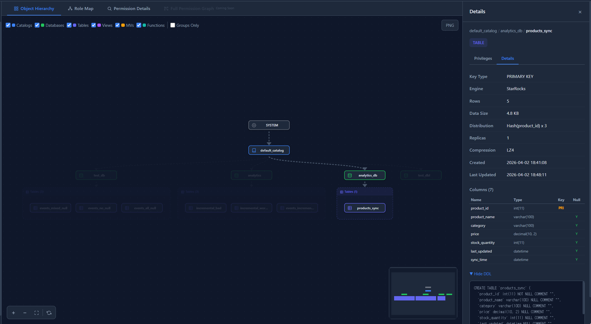

# StarRocks Permission Manager

A web UI for visually exploring user, role, and object permission structures across StarRocks clusters using DAG (Directed Acyclic Graph) visualization.


## Features

- **4 Tabs** for different exploration modes
  - **Object Hierarchy**: SYSTEM → CATALOG → DATABASE → Tables / Views / MVs / Functions (top-to-bottom DAG)
  - **Role Map**: root → built-in roles → custom roles → users (top-to-bottom DAG)
  - **Permission Details**: Search a user or role → view inheritance DAG + privilege list
  - **Full Permission Graph**: Users → Roles → Objects unified view (coming soon)
- **Object-Centric View** — Click an object to see a permission matrix (Users/Roles × Privilege types, Direct/Inherited)
- **User-Centric View** — Click a user to see assigned roles and accessible objects tree (Catalog → DB → Table)
- **Details Tab** — Type-specific metadata per object (INFORMATION_SCHEMA based, External Catalog compatible)
- **Sidebar Navigation** — Searchable hierarchy browser with hide/show toggles per node
- **Filters** — Toggle node types via checkboxes, Groups Only mode
- **Export** — Download DAG as high-resolution PNG
- **Customization** — Replace SVG icons and app logo

## Screenshots

### Object Hierarchy


### Role Map


### Permission Details


### Object Detail — Permission Matrix


### User Detail — Effective Privileges


### Table Detail — Metadata


## Architecture

```
├── Dockerfile           # Multi-stage build (frontend + backend)
├── backend/             # Python FastAPI server
│   ├── requirements.txt
│   ├── API.md           # Detailed API documentation
│   └── app/
│       ├── main.py
│       ├── config.py
│       ├── dependencies.py
│       ├── routers/     # auth, objects, privileges, roles, dag, search
│       ├── services/    # starrocks_client, search, user_service
│       ├── models/      # Pydantic schemas
│       └── utils/       # JWT session, session store, cache
└── frontend/            # React 18 + Vite + TypeScript
    ├── icons/           # Customizable SVG icons (single source of truth)
    └── src/
        ├── api/         # API clients
        ├── stores/      # Zustand state management
        └── components/
            ├── auth/    # Login form
            ├── layout/  # Header, Sidebar (search + hierarchy browser)
            ├── dag/     # React Flow + dagre layout
            ├── tabs/    # Permission Details tab
            └── panels/  # Object / User / Group detail panels
```

## Quick Start

### Docker (Recommended)

```bash
docker build -t starrocks-permission-manager .
docker run -d -p 8001:8001 \
  -e SRPM_JWT_SECRET=your-secret-key \
  starrocks-permission-manager
```

Open http://localhost:8001 and log in with your StarRocks credentials.

> **Note:** The Docker image runs a single worker (`--workers 1`) because the in-memory session store is per-process. For multi-worker deployments, use a shared session backend (e.g., Redis) or sticky sessions.

### Development

**Prerequisites:** Python 3.10+, Node.js 18+, npm 9+

**Backend (Terminal 1):**
```bash
cd backend
python -m venv venv
source venv/bin/activate        # Windows: venv\Scripts\activate
pip install -r requirements.txt
uvicorn app.main:app --reload --port 8001
```
- API server: http://localhost:8001
- Swagger UI: http://localhost:8001/docs

**Frontend (Terminal 2):**
```bash
cd frontend
npm install
npm run dev
```
- App: http://localhost:5173
- API requests are proxied to the backend (`/api/*` → `localhost:8001`)

### Production Build

```bash
# Build frontend
cd frontend && npm run build    # → dist/

# Run backend serving static files
cd backend
uvicorn app.main:app --host 0.0.0.0 --port 8001
```

Or use **Nginx** to serve the frontend and proxy API requests:
```nginx
server {
    listen 80;
    root /path/to/frontend/dist;
    index index.html;

    location /api/ {
        proxy_pass http://localhost:8001;
        proxy_set_header Host $host;
        proxy_set_header X-Real-IP $remote_addr;
    }

    location / {
        try_files $uri $uri/ /index.html;
    }
}
```

## UI Guide

### Tabs

| Tab | Description | Sidebar | Detail Panel |
|-----|-------------|---------|--------------|
| **Object Hierarchy** | Visualizes SYSTEM → Catalog → DB → Objects as a top-down DAG. Group containers bundle tables/views/MVs/functions per database. | Hierarchy browser + search + hide/show toggles | Object privileges, table metadata |
| **Role Map** | Shows role inheritance (root → built-in → custom → users) as a top-down DAG. | Role/user list + hide/show toggles | Role privileges, user details |
| **Permission Details** | Search for a user or role to view their inheritance DAG and full privilege list side-by-side. | Hidden | Integrated into tab |
| **Full Permission Graph** | Combined users → roles → objects graph with privilege-colored edges. | — | Coming soon |

### Sidebar

- **Search**: Debounced full-text search across objects, users, and roles. Click a result to navigate and highlight in the DAG.
- **Hierarchy Browser**: Expandable catalog → database → type group → objects tree.
- **Hide/Show Toggles**: Eye icon on each item to show/hide individual nodes in the DAG.

### Detail Panels

- **Object Panel**: Two sub-tabs — *Privileges* (permission matrix showing grantees × privilege types with Direct/Inherited indicators) and *Details* (columns, DDL, partition/distribution info).
- **User Panel**: Assigned roles, accessible objects tree grouped by catalog → database.
- **Group Panel**: Paginated list of child objects within a container node.

### Node Interaction

- **Click a node**: Highlights the full ancestor + descendant chain. Opens the detail panel.
- **Click background**: Clears highlight.
- **Type filter checkboxes**: Toggle visibility of node types (table, view, mv, function, user, role).
- **Groups Only**: Shows only group container nodes, hiding individual objects.

## API Usage

```bash
# Login
curl -X POST http://localhost:8001/api/auth/login \
  -H "Content-Type: application/json" \
  -d '{"host":"your-starrocks-host","port":9030,"username":"admin","password":"pwd"}'

# Extract token from response
TOKEN="eyJhbG..."

# List catalogs
curl http://localhost:8001/api/objects/catalogs \
  -H "Authorization: Bearer $TOKEN"

# Object Hierarchy DAG
curl "http://localhost:8001/api/dag/object-hierarchy?catalog=default_catalog" \
  -H "Authorization: Bearer $TOKEN"
```

Full API documentation: [backend/API.md](backend/API.md)

## Testing

```bash
cd backend
source venv/bin/activate
```

**Unit tests** (mock DB, no StarRocks connection required):
```bash
python -m pytest tests/ -v
```

**Integration tests** (requires a running StarRocks instance):
```bash
export SR_TEST_HOST=your-starrocks-host
export SR_TEST_PORT=9030
export SR_TEST_USER=admin
export SR_TEST_PASS=your-password
python -m pytest tests/test_integration.py -v -s
```

**Frontend type check:**
```bash
cd frontend
npx tsc --noEmit
npm run build
```

### Test Coverage

| File | Tests | Scope |
|------|-------|-------|
| `test_health.py` | 1 | Health check |
| `test_auth.py` | 5 | Login success/failure, me, parameter validation |
| `test_objects.py` | 6 | Catalogs, databases, tables, table-detail |
| `test_privileges.py` | 4 | User direct/effective/object privileges |
| `test_roles.py` | 3 | Roles, hierarchy DAG, role users |
| `test_dag.py` | 5 | Object-hierarchy, role-hierarchy, full, filters, schema |
| `test_search.py` | 5 | Search API |
| `test_session_store.py` | 6 | Server-side session store |
| `test_sql_safety.py` | 8 | SQL injection protection (safe_name, safe_identifier) |
| `test_integration.py` | 12 | Full API against real StarRocks (skipped without env vars) |

## Environment Variables

**Backend:**
| Variable | Default | Description |
|----------|---------|-------------|
| `SRPM_JWT_SECRET` | `change-me-...` | JWT signing key (**must change in production**) |
| `SRPM_JWT_EXPIRE_MINUTES` | `60` | Token expiration time (minutes) |
| `SRPM_CACHE_TTL_SECONDS` | `60` | Server-side cache TTL |

**Integration tests:**
| Variable | Description |
|----------|-------------|
| `SR_TEST_HOST` | StarRocks FE host |
| `SR_TEST_PORT` | MySQL protocol port (default 9030) |
| `SR_TEST_USER` | Test username |
| `SR_TEST_PASS` | Test password |

## Tech Stack

| Layer | Technology |
|-------|-----------|
| Backend | Python 3.10+, FastAPI, mysql-connector-python, PyJWT |
| Frontend | React 18, Vite, TypeScript, React Flow (@xyflow/react), dagre, Tailwind CSS, Zustand |
| Deployment | Docker (multi-stage build) |

## API Endpoints (18)

### Authentication
| Method | Path | Description |
|--------|------|-------------|
| POST | `/api/auth/login` | Login with StarRocks credentials → JWT |
| POST | `/api/auth/logout` | Invalidate server-side session |
| GET | `/api/auth/me` | Current user info + roles |

### Objects
| Method | Path | Description |
|--------|------|-------------|
| GET | `/api/objects/catalogs` | List catalogs |
| GET | `/api/objects/databases?catalog=X` | List databases |
| GET | `/api/objects/tables?catalog=X&database=Y` | List tables/views/MVs/functions |
| GET | `/api/objects/table-detail?catalog=X&database=Y&table=Z` | Detailed metadata |

### Privileges
| Method | Path | Description |
|--------|------|-------------|
| GET | `/api/privileges/user/{name}` | User direct privileges |
| GET | `/api/privileges/user/{name}/effective` | Effective privileges (including inherited) |
| GET | `/api/privileges/object?catalog=X&database=Y&name=Z` | Privileges on an object |

### Roles
| Method | Path | Description |
|--------|------|-------------|
| GET | `/api/roles` | List roles |
| GET | `/api/roles/hierarchy` | Role inheritance DAG |
| GET | `/api/roles/{name}/users` | Users assigned to a role |

### DAG
| Method | Path | Description |
|--------|------|-------------|
| GET | `/api/dag/object-hierarchy?catalog=X` | Object hierarchy DAG |
| GET | `/api/dag/role-hierarchy` | Role hierarchy DAG |
| GET | `/api/dag/full?catalog=X` | Full permission DAG |

### Search & Health
| Method | Path | Description |
|--------|------|-------------|
| GET | `/api/search?q=keyword&limit=50` | Unified search (objects/users/roles) |
| GET | `/api/health` | Server health check (no auth required) |

## Icon Customization

Replace SVG files in `frontend/icons/` to change icons across the entire app (DAG nodes, sidebar, header, login). See [frontend/icons/README.md](frontend/icons/README.md) for details.

## External Catalog Support

Uses `information_schema.tables` and `columns` as the primary data source, making it compatible with Hive, Iceberg, JDBC, Elasticsearch, and other External Catalogs. Internal Catalog-specific metadata (partitions, buckets, storage, etc.) is supplemented via `partitions_meta` + DDL parsing. Unsupported sections are automatically hidden.

## Roadmap

| Version | Feature |
|---------|---------|
| v1.0 | Read-only permission exploration & visualization (current) |
| v1.1 | Full Permission Graph tab |
| v2.0 | GRANT/REVOKE UI, Bulk Operations |
| v2.1 | Audit Log, Permission Diff |
| v2.2 | Alert Rules, Export (CSV/PDF) |

## License

MIT
